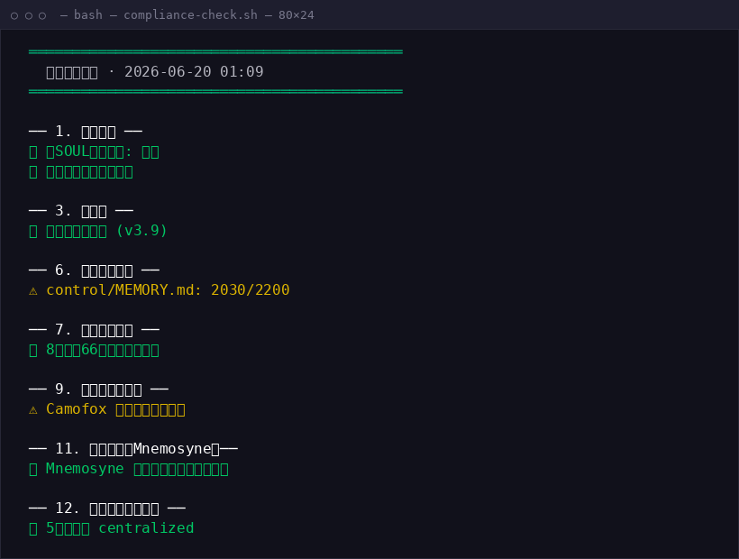

# System Guardian · 系统卫士 🇨🇳🌐

**Your Hermes Agent. One command health check. 12 dimensions. 3 seconds.**  
*你的 Hermes Agent。一条命令，12 维检查，3 秒出结果。*

[](LICENSE)
[](https://hermes-agent.nousresearch.com)
[](https://github.com/sqzy1314520/system-guardian)

---

## What it looks like · 跑起来就这样



One command, 12 checks, 3 seconds. Your whole system health, at a glance.

---

## Quick start · 30 秒上手

### Option A: Install as a Hermes skill

```bash
hermes skills install https://github.com/sqzy1314520/system-guardian/raw/main/SKILL.md
```

Then just say to your agent:

| You say | What happens |
|---------|-------------|
| "检查一下" / "Check health" | 10-dimension scan in 3 seconds |
| "查查哪里不对" / "Diagnose" | Deep audit + root cause analysis |

### Option B: Run standalone (no Hermes needed)

```bash
# Download the check script
curl -O https://raw.githubusercontent.com/sqzy1314520/system-guardian/main/scripts/compliance-check.sh

# Make it executable
chmod +x compliance-check.sh

# Run it (customize HERMES_HOME if needed)
HERMES_HOME=~/.hermes bash compliance-check.sh
```

---

## What's included · 有什么

| Component | What it does | Public |
|:---------|:-------------|:------:|
| **system-guardian** | Self-check, audit, heartbeat, goal evaluation | ✅ MIT |
| **compliance-check.sh** | 10-dimension health check script (standalone) | ✅ MIT |
| **cron-manager** | Cron job creation, audit, troubleshooting | ✅ MIT |
| **system-onboarding** | First-time setup wizard | ✅ MIT |
| **goal-tracker** | System goal management | ✅ MIT |

Details in [`skills/`](skills/) directory.

---

## The problem it solves · 解决什么问题

| You installed Hermes and... | System Guardian solves it |
|----------------------------|---------------------------|
| "Is my system still healthy today?" | **Check** — One command, 10 dimensions, a few seconds. Memory, cron, heartbeat, external memory, compliance. |
| "Something broke. Where do I look?" | **Diagnose** — Deep probe with syndrome detection. Not symptoms → root cause. |
| "I need a cron job but don't know how" | **cron-manager** — 3 questions, auto-setup. |

---

## Scripts included · 内附脚本

| Script | Lines | What it checks |
|:-------|:-----:|:---------------|
| `scripts/compliance-check.sh` | ~130 | Identity, version anchor, memory watermark, skills health, cron, heartbeat, Mnemosyne, approvals, backup |

Usage:

```bash
HERMES_HOME=~/.hermes bash scripts/compliance-check.sh
```

---

## License

MIT — do whatever you want, just don't blame us.

---

## Sponsor · 赞助

If this saved you time, [buy me a coffee](https://buymeacoffee.com/sqzy1314520) ☕
国内用户：[爱发电](https://afdian.com/a/meijiexueAI)

---

*Built with ❤️ for the Hermes Agent community.*
